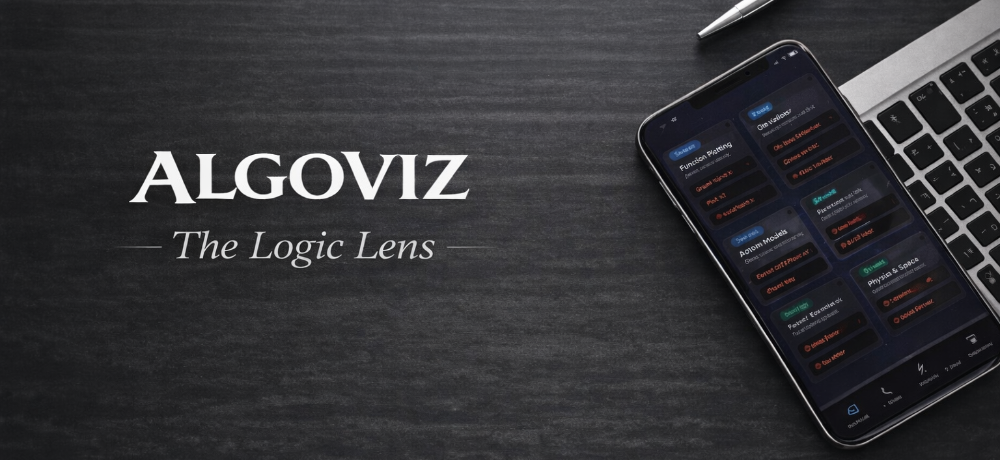

  

# *AlgoViz*
# (The Logic Lens)
### "Making Algorithms Visible, Intuitive, and Explainable"

🌐 *Live Project:* [AlgoViz App](https://algoviz-web.vercel.app/)

> **AlgoViz** is an algorithm visualization and learning platform that transforms abstract algorithm execution into **clear visual flows, intuitive explanations, and interactive replays**, helping learners understand not just **how** an algorithm works, but **why** it works — and **where** it fails*.
 
## 🧠 Problem Statement

Algorithms are fundamental to computer science, yet they are commonly taught using:

- Static source code
- Mathematical formulas
- Text-heavy explanations

These approaches fail to provide:
- Clear visualization of step-by-step execution
- Intuition for time complexity growth
- Awareness of edge cases and algorithm limitations

As a result, learners often **memorize algorithms instead of understanding them**, leading to weak problem-solving skills and low confidence.

## 💡 Our Solution — AlgoViz

**AlgoViz bridges the gap between code and comprehension.**

## Designed to help learners build algorithmic intuition — not just memorize code.

It converts algorithm logic into **interactive, visual, and explainable experiences**, enabling learners to:
- See algorithms execute step by step
- Visually understand performance growth
- Discover blind spots and inefficiencies

📌 AlgoViz focuses on **intuition-first learning**, not rote memorization.

## 🌟 Advanced Features

- **Step-by-Step Animation**: Visualizes algorithms in clear steps.
- **Difficulty-Based Explanations**: Adjusts content to the learner’s level.
- **Text-to-Speech Narration**: Automatically narrates each step.
- **Live Code Visualization**: Shows corresponding Language/pseudo-code.
- **Premium Glassmorphism UI**: Sleek dark theme with blur and gradients.
- **Speech Recognition**: Recognises the speech of user.
- **Interactive Scene Breakdown**: Highlights steps in a clickable format.
- **Video Export Feature**:  Record and download `.webm` videos directly from the browser.

## 🚀 Core Capabilities

- **Natural Language Input**: Describe algorithms in plain English.
- **Rule-Based Engine**: Controls algorithm flow with rules.
- **Live Preview**: Canvas-based rendering with full playback controls.

## 🧰 Tech Stack

## 🔹 Core Languages 

**Frontend**: React.js, Tailwind CSS
**Backend & API Layer**: Python (Flask) for algorithm & AI services, Node.js + Express.js for orchestration and integration APIs
**AI & Algorithm Logic**: Python
**Database**: Firebase Firestore
**Authentication**: Firebase Authentication
**File Storage**: Firebase Cloud Storage
**AI APIs**: Google AI Studio
**Rendering**: HTML5 Canvas API.
**Version Control**: Git & GitHub

🧠 Python is the primary language to support algorithm simulation, AI reasoning, and educational computation accuracy.

## 🚀 Launch & Live Experience

AlgoViz is fully cloud-native, delivering a smooth and intelligent learning experience from anywhere in the world:

- 🚀 **Instant Frontend Delivery:** Hosted on **Vercel**, ensuring blazing-fast loads and responsive interactions.
- 🔧 **Serverless Backend Power:** APIs run on **Vercel Serverless** and **Firebase Functions**, scaling automatically with usage.
- 🔒 **Secure & Real-Time Data:** **Firebase Firestore** and **Authentication** handle data persistence and user security.
- 🤖 **AI-Driven Intelligence:** **Google AI Studio** fuels smart algorithm insights, explanations, and code generation.

## 🎥 Video Export

-  The `.webm` file will download automatically.

## 🎯 Use Cases

- 📘 Students learning algorithms & data structures  
- 👩‍🏫 Educators teaching complex logic visually  
- 🏆 Hackathons & academic demonstrations  
- 🧠 Quick revision before exams & interviews  

## 🔮 Future Work

- Algorithm Blind-Spot Revealer
- Time Complexity Intuition Builder
- Logic Compression Replay
- Mistake Simulator

## 📁 Repository Structure

/frontend   → React + Tailwind UI  
/backend    → API & orchestration layer  
/engine     → Python algorithm & AI logic  

## 🧑‍💻 *Developed By*

### *Team Innovexa*

- Built to educate. Designed to explain. Created to innovate.

| Name | Role | LinkedIn |
|------|------|-----------|
| *P.S.L.Sampath Kumar* | Team Lead,Developer | [LinkedIn](https://www.linkedin.com/in/sri-lakshmi-sampath-kumar-pachala-1b8813369) |
| *Sai Charan Pasupuleti* | Developer | [LinkedIn](https://www.linkedin.com/in/saicharanpasupuleti) |
| *Aishwarya Natesan* | Developer | [LinkedIn](https://www.linkedin.com/in/aishwarya-natesan-bb48a1360) |

📧 *Contact:*
- pslsampathkumar@gmail.com
- psai73873@gmail.com
- natesanaishwarya@gmail.com
---
⭐ *If you like this project, consider giving it a star on GitHub!*
